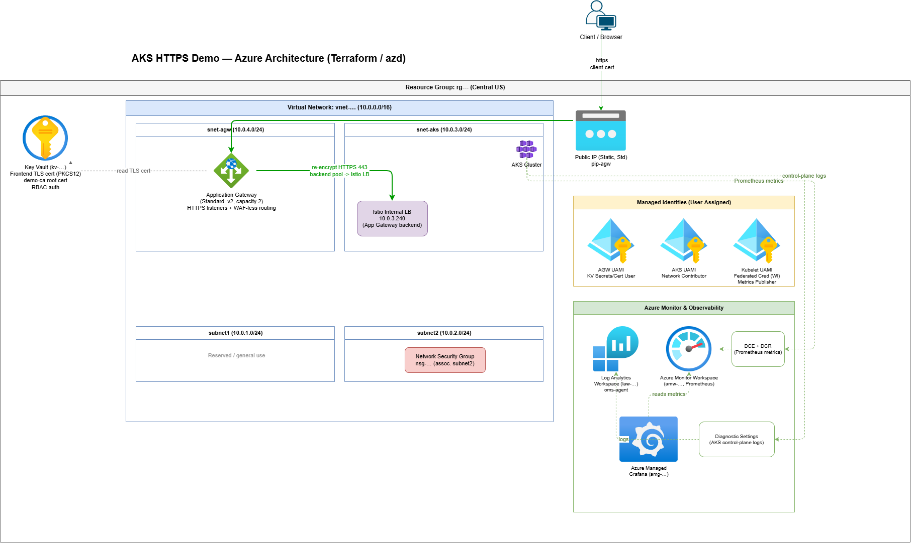
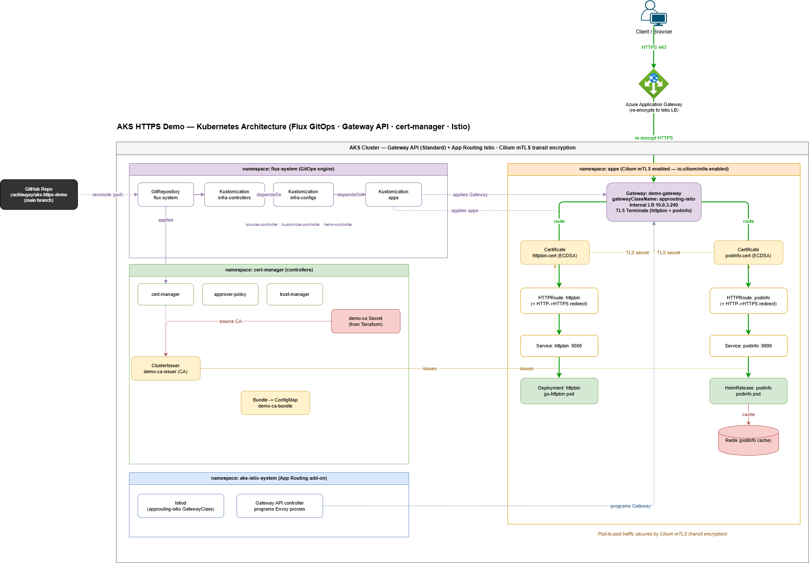

# AKS HTTPS Demo

This repository demonstrates provisioning Azure infrastructure and Kubernetes manifests to create an encrypted end to end solution.

An Azure App Gateway proxies traffic to an AKS Cluster via the Gateway API.
The App Gateway has a client certificate stored in a key vault where the Gateway API utilizes `cert-manager`.
Traffic from the client to the gateway is end to end encrypted with a client cert, and terminated at the Gateway.
Traffic from the gateway to the AKS Istio Gateway is re-encrypted via certs serviced by `cert-manager`.

## Prerequisuites

Make sure you have Azure Developer CLI installed.

## Setup

1. Clone the repository
2. Set environment variables
3. Make sure your Azure environment has all the correct registrations
4. `azd up`

Make sure you create the GitHub token.

- You must have a `KUBECONFIG` environment variable pointing to your aks context.
- You must have a `GITHUB_TOKEN` defined with the [appropiate permissions](https://fluxcd.io/flux/installation/bootstrap/github/#github-pat) for flux GitOps operator.

### How to

The Terraform variables in `infra/main.tfvars.json` are populated from the azd
environment. Set every value below before running `azd up`; `AZURE_ENV_NAME`
and `AZURE_LOCATION` are set for you by `azd env new`.

```bash
git clone https://github.com/zachbugay/aks-https-demo.git
cd aks-https-demo

# Create the azd environment (sets AZURE_ENV_NAME and AZURE_LOCATION).
azd env new dev --location centralus

# GitOps / cluster access.
azd env set KUBECONFIG "$HOME/.kube/config"
azd env set GITHUB_USERNAME "<gh-username>"
azd env set GITHUB_REPO_NAME "<gh-repo-name>"
azd env set GITHUB_TOKEN "<gh-token>"

# Terraform inputs consumed by infra/main.tfvars.json.
azd env set WORKLOAD_NAME "jaycat"
azd env set HTTPBIN_HOSTNAME "zachb-httpbin.duckdns.org"
azd env set PODINFO_HOSTNAME "zachb-podinfo.duckdns.org"
azd env set ENABLE_CILIUM_MTLS "true"
azd env set ENABLE_LOCAL_DNS "true"

# Raw JSON array — keep the brackets and quotes intact.
azd env set ADMIN_GROUP_OBJECT_IDS '["objectId1", "objectId2"]'

# One-time subscription registrations for the Cilium mTLS preview.
az feature register --namespace Microsoft.ContainerService --name AdvancedNetworkingmTLSPreview
az provider register --namespace Microsoft.ContainerService

azd up
```

## Diagrams

### Azure



### AKS


